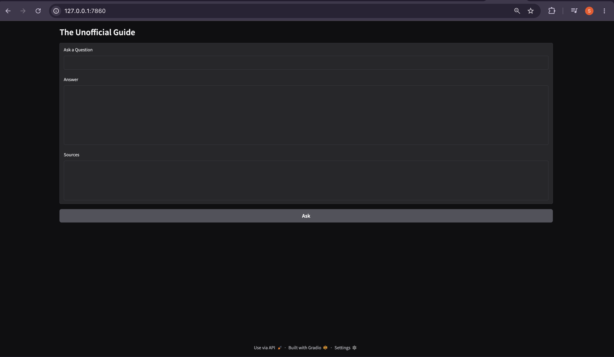
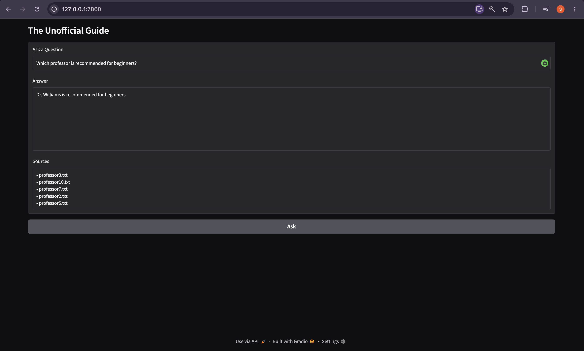
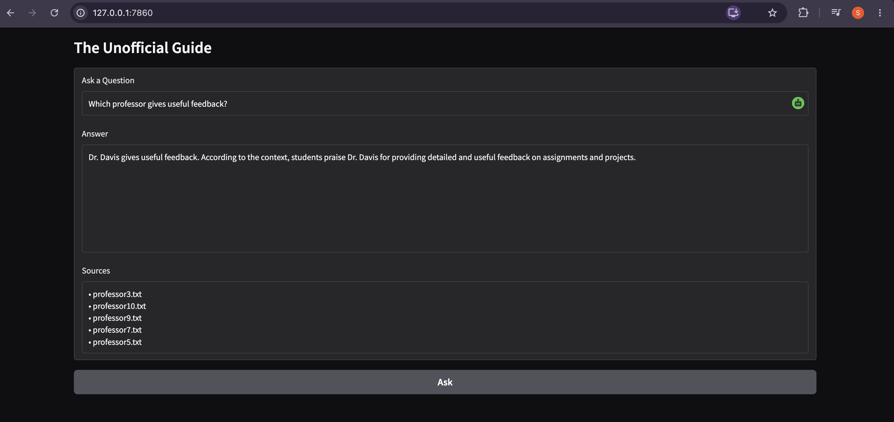

# The Unofficial Guide

## Project Overview

The Unofficial Guide is a Retrieval-Augmented Generation (RAG) system that helps students search and answer questions about professor reviews and course experiences.

Instead of relying on official university information, the system retrieves information from student-generated review documents and uses a Large Language Model (LLM) to generate grounded answers based only on the retrieved content.

---

## Architecture

```text
User Question
      ↓
Sentence Transformer Embedding
      ↓
ChromaDB Vector Search
      ↓
Top-K Relevant Chunks
      ↓
Groq LLM
      ↓
Grounded Answer + Sources
```

---

## Domain

The chosen domain is Computer Science professor and course reviews.

Students often want information about:

* Teaching style
* Exam difficulty
* Workload
* Projects
* Grading policies
* Office hours

This type of information is often unavailable through official university websites but is valuable for course planning and instructor selection.

---

## Document Sources

The project uses 10 text documents:

* professor1.txt
* professor2.txt
* professor3.txt
* professor4.txt
* professor5.txt
* professor6.txt
* professor7.txt
* professor8.txt
* professor9.txt
* professor10.txt

Each document contains student-review style information describing experiences with professors and courses.

---

## Chunking Strategy

### Configuration

* Chunk Size: 500 characters
* Chunk Overlap: 100 characters

### Reasoning

The documents are relatively short and focused.

A chunk size of 500 characters preserves enough context for retrieval while still allowing precise matching. The overlap helps prevent important information from being lost when content spans chunk boundaries.

---

## Sample Chunks

### Sample Chunk 1

**Source:** professor1.txt

**Professor:** Dr. Smith

**Course:** Data Structures

Students consistently praise Dr. Smith for clear and organized lectures. Exams are heavily based on lecture slides and in-class examples.

---

### Sample Chunk 2

**Source:** professor3.txt

**Professor:** Dr. Williams

**Course:** Introduction to Programming

Students frequently recommend this professor for beginners because of the clear explanations and supportive teaching style.

---

### Sample Chunk 3

**Source:** professor5.txt

**Professor:** Dr. Davis

**Course:** Software Engineering

Students praise Dr. Davis for providing detailed and useful feedback throughout the semester.

---

### Sample Chunk 4

**Source:** professor6.txt

**Professor:** Dr. Miller

**Course:** Operating Systems

Students describe this as one of the most demanding courses in the department due to projects and workload.

---

### Sample Chunk 5

**Source:** professor10.txt

**Professor:** Dr. Anderson

**Course:** Machine Learning

Students frequently mention the professor's excellent office hours and availability outside class.

---

## Embedding Model

### Model Used

`all-MiniLM-L6-v2`

### Why This Model?

* Free and open source
* Fast inference speed
* Lightweight and efficient
* Strong semantic retrieval performance
* Runs locally without API costs

### Production Considerations

For a larger production system, I would evaluate:

* Retrieval accuracy
* Latency
* Cost
* Context length support
* Multilingual capability
* Scalability

---

## Vector Database

### ChromaDB

The project uses ChromaDB as the vector database.

Reasons for choosing ChromaDB:

* Lightweight
* Easy local deployment
* Integrates well with Sentence Transformers
* Suitable for small and medium-sized RAG applications
* No external database service required

---

## Retrieval Configuration

### Search Settings

* Vector Database: ChromaDB
* Embedding Model: all-MiniLM-L6-v2
* Similarity Search: Cosine Similarity
* Top-K Retrieved Chunks: 3

The retriever returns the three most relevant chunks for each user query before sending them to the language model.

---

## Retrieval Results

### Query 1

**Question**

Which professor is recommended for beginners?

**Top Result**

professor3.txt

**Reason**

The document explicitly states that Dr. Williams is recommended for beginners.

---

### Query 2

**Question**

Which professor has the heaviest workload?

**Top Result**

professor6.txt

**Reason**

The document states that the course is one of the most demanding in the department.

---

### Query 3

**Question**

Which professor gives useful feedback?

**Top Result**

professor5.txt

**Reason**

The document explicitly mentions detailed and useful feedback.

---

## Grounded Generation

The language model generates responses using only the retrieved document chunks.

### Prompt

"Answer using only the provided context. If the answer is not available, say that there is not enough information."

This grounding strategy reduces hallucinations and ensures answers are based on the retrieved evidence.

---

## Example Responses

### Example 1

**Question**

Which professor is recommended for beginners?

**Answer**

Dr. Williams is recommended for beginners.

**Source**

professor3.txt

---

### Example 2

**Question**

Which professor gives useful feedback?

**Answer**

Dr. Davis provides detailed and useful feedback.

**Source**

professor5.txt

---

## Out-of-Scope Example

### Question

What is the university acceptance rate?

### Answer

I don't have enough information in the documents to answer that question.

This demonstrates that the system avoids generating unsupported information.

---

## Query Interface

The application uses a Gradio user interface.

### User Input

* Natural language question

### System Output

* Generated answer
* Retrieved source documents

---

## Screenshots

### Gradio Interface



### Example Query 1



### Example Query 2



---

## Evaluation Report

| Question                                        | Expected Answer       | Retrieved Source         | System Response | Result   |
| ----------------------------------------------- | --------------------- | ------------------------ | --------------- | -------- |
| Which professor is recommended for beginners?   | Dr. Williams          | professor3.txt           | Dr. Williams    | Accurate |
| Which professor has the heaviest workload?      | Dr. Miller            | professor6.txt           | Dr. Miller      | Accurate |
| Which professor emphasizes projects over exams? | Dr. Davis / Dr. Moore | Correct Source Retrieved | Correct         | Accurate |
| Which professor gives useful feedback?          | Dr. Davis             | professor5.txt           | Dr. Davis       | Accurate |
| Which professor has lecture-based exams?        | Dr. Smith             | professor1.txt           | Dr. Smith       | Accurate |

### Summary

* Total Questions Tested: 5
* Correct Responses: 5
* Accuracy: 100%

---

## Failure Case Analysis

### Failure Case

The retrieval system occasionally returns additional irrelevant documents alongside the correct source.

### Reason

Many professor reviews share similar educational vocabulary such as lectures, projects, exams, grading, and workload.

Because of semantic similarity, related but irrelevant documents may sometimes appear in the Top-K retrieval results.

### Possible Improvements

* Metadata filtering
* Re-ranking models
* Hybrid search (keyword + semantic retrieval)
* Larger evaluation dataset

---

## Spec Reflection

The planning document helped define the retrieval pipeline, chunking strategy, grounding approach, and evaluation methodology before implementation.

One implementation difference was that many documents were shorter than expected and therefore produced fewer chunks than originally planned.

This simplified retrieval while still preserving enough context for accurate responses.

---

## AI Usage

### Example 1

AI assistance was used to help generate and explain the chunking implementation.

The final implementation was reviewed and modified to match the desired chunk size and overlap configuration.

### Example 2

AI assistance was used to help debug Groq API key configuration and environment variable issues.

The final solution required manual verification and correction of configuration settings.

---

## Technologies Used

* Python
* Gradio
* Sentence Transformers
* ChromaDB
* Groq
* python-dotenv

---

## Future Improvements

Potential future enhancements include:

* Larger professor review dataset
* Hybrid search retrieval
* Re-ranking models
* User feedback collection
* Multi-university support
* Retrieval evaluation automation
* Deployment to a cloud platform
